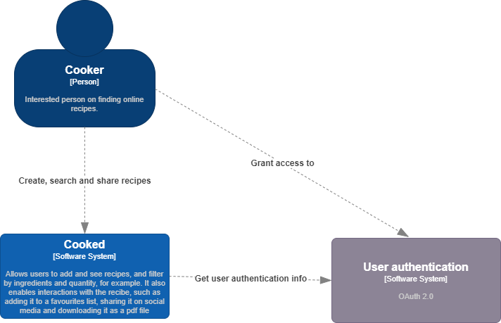
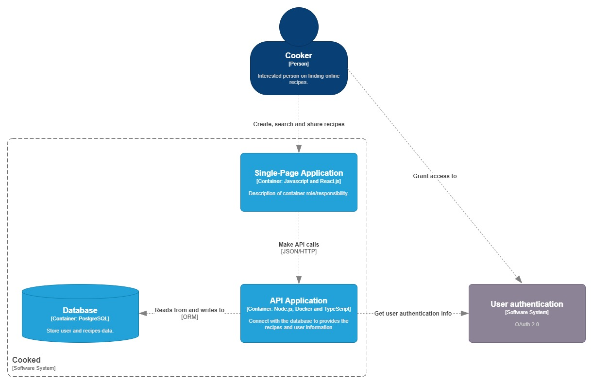
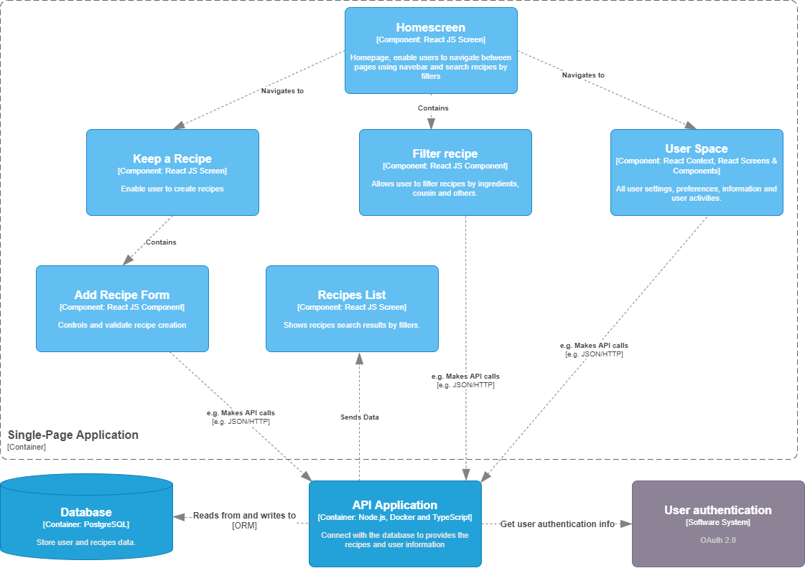

# Descrição do Projeto

O projeto consiste em uma aplicação web para o compartilhamento de receitas, em que usuários podem selecionar que ingredientes têm em sua cozinha e filtrar receitas com base nesses ingredientes.

## Integrantes
- Natalia Joventino Leonardo
- Michell Lucino
- Andrey Torres
- Frederico Rappa
- Francisco Pena

## Arquitetura do Projeto
- **Modelo C4 Context**

    

- **Modelo C4 Containers**

    
    
- **Modelo C4 Components** 

    

- Estilos Arquiteturais:
    - RESTful API's
    - Layering

- Descrição dos Componentes:

    - Homescreen:
    Tela inicial da aplicação: permite que os usuários naveguem para as outras telas, pesquisem e filtrem as receitas com o componente Filter Recipe.

    - Filter Recipe:
    Componente que possibilita a entrada e seleção de filtros para buscas de receitas na plataforma com base em nas opções do usuário e faz comunicação com a API Application com as informações

    - Recipes List:
    Após interação do filtro com a API, a API manda a base de dados que deve ser apresentada ao usuário para a página. Assim, permitindo a visualização e interação com a receita.

    - Keep a Recipe:
    Tela React JS que possibilita e contém as funcionabilidades, campos e dados necessários para que o usuário consiga adicionar novas receitas na plataforma.  
    
    - Add Recipe Form:
    Componente React JS responsável por controlar, validar e enviar as informações de criação da receita para o back-end.

    - User Space:
    Este componente é responsável por manter as informações do contexto do usuário, como seu estado de autenticação, informações pessoais, configurações e atividades, obtidas em chamadas à API Application.
